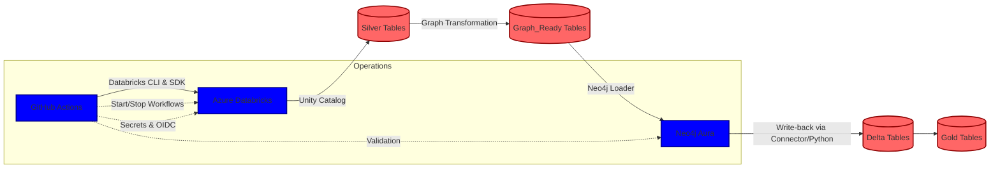

# Neo4j + Databricks ETL Pipeline (Simplified Guide)

This repository provides a single-click deployer and end-to-end pipeline integrating Azure Databricks with Neo4j Aura. 

**Use this repository to:**
- **Quick Start**: Run pipelines manually in an existing Databricks workspace with Neo4j Aura
- **Full Deployment**: Deploy and provision Azure Databricks workspace, Neo4j Aura instance, and validate the complete pipeline end-to-end (see [Deployment Workflows](docs/DEPLOYMENT.md) for detailed steps)

This update focuses on:
- A streamlined Quick Start for users who already have a Databricks workspace and Neo4j Aura.
- Clear pointers to detailed documentation for permissions, secrets, deployment workflows, configuration, monitoring/operations, troubleshooting, and validation.
- Start/Stop workflows to manage compute and validate connectivity.
- A manual-run path so you can explore the pipeline directly from the Databricks UI.

## Quick Start (Workspace + Aura already exist)

1. **Prerequisites**
   - Databricks workspace URL and a PAT (or OIDC setup) with permission to run jobs
   - Neo4j Aura URI (neo4j+s://...), username, and password
   - GitHub repository secrets set: `DATABRICKS_HOST`, `DATABRICKS_TOKEN`, `NEO4J_URI`, `NEO4J_USERNAME`, `NEO4J_PASSWORD`

2. **Import notebooks & run manually in Databricks**
   - Use the "Neo4j Integration Showcase" workflow or import notebooks with the existing workflow that uploads notebooks (see [Deployment Workflows](docs/DEPLOYMENT.md)).
   - In the Databricks workspace, open and run in order:
     1) `data-validation`
     2) `graph-transformation`
     3) `graph_ready_enhancements`
     4) `neo4j-loading`
     5) `customer_recommendations_writeback`
     6) `supplier_metrics_writeback`
   - Pass `catalog` (e.g., `dbx_poc`) and optional parameters as prompted.

3. **Validate connectivity and results**
   - Use the "Verify Neo4j Graph Data" job or the Python verification snippet in the workflow summary to confirm connection and basic counts.

4. **Optional: Start/Stop compute and validate Aura via GitHub Actions**
   - Start: run the `Compute Start` workflow with your `cluster_id` and repository secrets.
   - Stop: run the `Compute Stop` workflow with your `cluster_id`.
   - Both workflows print summary details to the GitHub job summary.

## Architecture

**System Flow:**
- GitHub Actions → Databricks (Jobs, CLI/SDK) → Unity Catalog Silver → graph_ready → Neo4j Aura → Delta write-backs → Gold
- Start/Stop workflows manage compute, secrets via OIDC, and validation paths

## Detailed References

- [Prerequisites](docs/PREREQUISITES.md) - Required permissions and tools
- [Secrets Configuration](docs/SECRETS_MANAGEMENT.md) - Secrets setup and management
- [Deployment Workflows](docs/DEPLOYMENT.md) - Deployment procedures
- [Configuration](docs/CONFIGURATION.md) - Configuration options
- [Architecture](docs/ARCHITECTURE.md) - Detailed architecture documentation
- [Troubleshooting](docs/TROUBLESHOOTING.md) - Common issues and solutions
- [Validation](docs/VALIDATION.md) - Validation procedures

## Manual-run Path (tested)

- After notebooks are imported to `/Shared/neo4j-pipeline`, run them in sequence as listed in Quick Start.
- For Serverless clusters (no JVM libs), the write-back notebooks will fall back to the Neo4j Python driver when necessary; otherwise, STANDARD clusters load the `org.neo4j.spark.DataSource` connector via library coordinates.
- The loader notebooks are idempotent; re-runs update Delta and Neo4j safely.

## Start/Stop Workflows

- **Compute Start**: starts a specified Databricks cluster, checks readiness, and validates Neo4j connectivity.
- **Compute Stop**: stops a specified Databricks cluster.
- See workflow files under `.github/workflows/`.

## Version History

See [CHANGELOG.md](CHANGELOG.md) for detailed version history and release notes.
